# Lat Lon Tools Plugin

***Lat Lon Tools*** makes it easy to capture, zoom to coordinates, convert coordinates in text fields into new point layers, export point geometry into text fields, and interact with other on-line mapping tools. It adds MGRS, Standard UTM, UPS, Geohash, GEOREF, Plus Code (Open Location Code), and ECEF coordinate support to QGIS. When working with **Google Earth**, **Google Maps** or other on-line mapping tools, coordinates are specified in the order of 'Latitude, Longitude'. By default ***Lat Lon Tools*** uses the standard Google Map format, but is very flexible and can use virtually any projection and coordinate format for input and output. The following tools are available in ***Lat Lon Tools***.

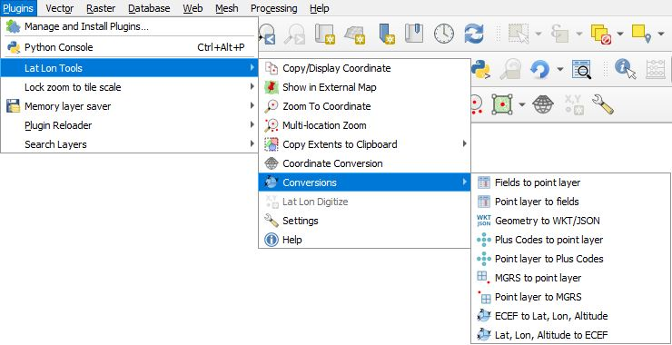

Here are the expanded ***Copy Extents to Clipboard*** menu items.

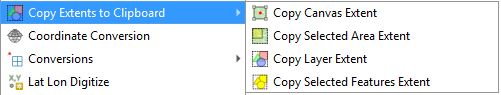

Some of the functions can be accessed from the ***Lat Lon Tools*** toolbar. If for some reason the toolbar is missing, select the menu item ***View->Toolbars*** and make sure ***Lat Lon Tools Toolbar*** is enabled. The conversion algorithms can be run from the QGIS Processing Toolbox.

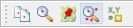

A number of the conversions can be accessed as field calculator functions. When in the ***Field Calculator*** find and expand the ***Lat Lon Tools*** menu. Clicking on each entry will give a description of the funciton with sample usage.

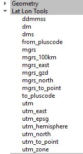

* 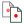 ***Copy/Display Coordinate*** - This captures coordinates onto the clipboard when the user clicks on the map, using the standard Google Map format or a format specified in ***Settings***. If the user specifies a **Tab** separator, then the coordinate can be pasted into a spreadsheet in separate columns. While this tool is selected, the coordinate the mouse is over is shown in the lower left-hand corner either in **decimal degrees**, **DMS**, **Degrees Minutes**, **MGRS**, **Standard UTM**, **UPS**, **GEOREF**, **Plus Codes (Open Location Code)**, **Geohash**, **H3** (if the H3 library is installed), **Maidenhead Grid Locator**, **WKT POINT**, or **GeoJSON** notation depending on the **Settings**. By default it uses the geographic Latitude and Longitude to snapshot the coordinate, but this can be configured in **Settings** to use the project CRS or any other projection desired. See the **Settings** section for more details on the all the possibilities. An additional prefix or suffix can be added to the coordinate and is configured in **Settings**. If snapping is enabled under QGIS ***Project->Snapping Options...*** menu, then *Copy/Display Coordinate* will snap to any close vector vertices according to the parameters set in the snapping options.
  
*  ***Show in External Map*** - With this tool, the user can click on the QGIS map which launches an external browser and displays the location on an external map. The left and right mouse buttons can be configured to show different maps. Currently Open Street Map, Google Maps, Google Earth Web, MapQuest, Mapillary, Open Street Map iD Editor, and Bing Maps are supported along with Google Earth if it is installed on the system. The desired map that is displayed can be configured in ***Settings*** along with additional user added map services. A temporary marker can be displayed on the map at the location clicked on. To turn this on go to **Settings**. If snapping is enabled, then the clicked location will snap to any close vector vertices according to the parameters set in the snapping options.

*  ***Zoom to Coordinate*** - With this tool, type or paste a coordinate into the text area and hit **Enter**. QGIS centers the map on the coordinate, highlights the location and creates a temporary marker at the location. Pressing the 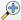 also causes QGIS to zoom to that location. For formats that represent a region rather than a point such as **Geohash**, **H3**, **Maindenhead**, and **Plus Codes (Open Location Code)** it displays the region area along with the center point. The marker can be removed with the 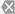 button. Pressing  **Paste Coordinate from Clipboard** button pastes the contents of the clipboard into the text area. If the default **WGS 84** (EPSG:4326 - latitude/longitude) coordinate system is specified, ***Zoom to Coordinate*** can interpret **decimal degrees**, **DMS**, **WKT POINT**, **Standard UTM**, **UPS**, **MGRS**, **GEOREF**, **Plus Codes (Open Location Code)**, or **GeoJSON** coordinates. It can also zoom to **Geohash** coordinates, amateur radio **Maidenhead** grid coordinates, **H3** geohash coordinates (if the H3 library is installed), or any other projection when configured in **Settings**. The ***Coordinate Order*** in ***Settings*** dictates whether the order is latitude followed by longitude (Y,X) or longitude followed by latitude (X,Y). By default the order is "Latitude, Longitude", the format used by Google Maps. The behavior and coordinate types that are interpreted can be configured by pressing the **Settings** button 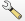. 
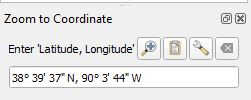
 The following are acceptable coordinate formats when the ***Settings*** **Zoom to Coordinate Type** is set to ***WGS 84 (Latitude & Longitude)***. When the letters "N, S, E, W" are used, then the coordinate order is not important. These letters can be used before or after the coordinates. As long as the coordinate is understandable, punctuation, spaces, and &deg; ' " are optional. In these examples "d" represents degree digits, "m" minutes, and "s" seconds. Here are some example input formats:

    * Decimal Degree: 38.959390&deg;, -95.265483&deg; / 38.959390, -95.265483 / 38.959390N, 95.265483 W (d.dddd, d.dddd)
    * Degree, Minute: 38&deg; 57.5634'N 95&deg; 15.92890'W (d m.mmmm, d m.mmmm)
    * Degree, Minute: 3857.5634N 09515.92890W (ddmm.mmmm, dddmm.mmmm) - In this format the degree digits need to be 0 padded using 2 digits for latitude, and 3 digits for longitude degrees.
    * Degree, Minute, Second: 38&deg;57'33.804"N, 95&deg;15'55.739"W (d m s.ssss, d m s.ssss)
    * Degree, Minute, Second: 385733.804N 0951555.739W (ddmmss.ssss, dddmmss.ssss) - In this format the degree digits need to be 0 padded with 2 digits for latitude, and 3 digits for longitude.
    * Degree, Minute, Second: 004656S, 0093917E (ddmmss, dddmmss)- Notice the need for 0 padding in the decimal degree digits.
    * WKT: POINT(-95.265483 38.959390)
    * GeoJSON: {"type": "Point","coordinates": [-95.265483,38.959390]}
    * Standard WGS84 UTM: Note that the UTM standard does not include the MGRS latitude band which some use. Lat Lon Tools uses the proper UTM standard with zone and hemisphere where hemisphere is either N (north of the equator) or S (south of the equator). UTM is valid from - 80&deg;S to 84&deg;N.
        * 15N 303704.9 4314710.9 (ZoneHemisphere Easting Northing)
        * 303704.9,4314710.9,15N (Easting,Northing,ZoneHemisphere)
        * 303704.9mE,4314710.9mN,15N (Easting,Northing,ZoneHemisphere)
        * 303704.9mE,4314710.9mN,15,N (Easting,Northing,Zone,Hemisphere)
    * UPS (Universal Polar Stereographic): This is the equavalent to UTM except for the polar regions. It is defined north of 84&deg; and south of -80&deg;
        * Z 2426773mE 1530125mN
        * Z2426773E1530125N
    * GEOREF: FJKJ4407157563
    * Example MGRS coordinate when **Zoom to Coordinate Type** is set to ***MGRS***: 15S UD 03704 14710
    * Example Plus Code coordinate when **Zoom to Coordinate Type** is set to ***Plus Codes***: 86C6XP5M+QR
    * Example Geohash coordinate when **Zoom to Coordinate Type** is set to ***Geohash***: 9yum8hmfckem
    * Example Amateur Radio Maidenhead coordinate when **Zoom to Coordinate Type** is set to ***Maidenhead Grid Locator***: EM28ix (Note that the center point of the grid is the location that is returned.)
    * Example H3 geohash coordinate when **Zoom to Coordinate Type** is set to ***H3***: 8826e5badbfffff

*  ***Multi-location Zoom*** - Here the user can define a set of quick zoom-to locations. The user can also paste in or type in a coordinate in the ***Enter coordinate*** box to add it to the list. By default the format of the data entered is **"latitude,longitude[,label,data1,...,data10]"** where the contents in [...] are optional. Various input formats are supported and can be configured in **Settings** by selecting the input projection and coordinate order. These include:

    * **"latitude,longitude[,label,data1,...,data10]"**
    * **"longitude,latitude[,label,data1,...,data10]"**
    * **"mgrs[,label,data1,...,data10]"**
    * **"Y,X[,label,data1,...,data10]"**
    * **"X,Y[,label,data1,...,data10]"**
    * **"plus codes[,label,data1,...,data10]"**
    * **"standard utm[,label,data1,...,data10]"**
   
    When the user clicks on a location in the list, QGIS centers the map on the location and highlights it. Double clicking on a **Label** or **Data** cell allows the text to be edited. By default the **Data** fields will not be visible, but can be added from ***Settings***. More than one location can be selected by clicking on the first point and then Shift-Click to select a range or using Ctrl-Click to add additional selected items. Markers for all selected items will be displayed. The following are additional functions.

    * 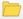 ***Open Location List*** reads in a set of coordinates that are comma separated with an optional label. There should only be one location per line and formatted as **"latitude,longitude,label,data1,...,data10"** or simply **"latitude,longitude"**.
    * 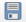 ***Save Location List*** saves all of the zoom-to entries in a .csv file, formatted as **"latitude,longitude,label,data1,...,data10"**.
    *  ***Delete Selected Location*** removes all selected locations. 
    * 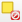 ***Clear All Locations*** clears the list of all locations.
    * 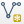 ***Create Vector Layer From Location List*** creates a memory layer out of the zoom-to locations. 
    *  ***Show Style Settings*** chooses a style for the layer created from the create layer button. This displays the **Settings** dialog box.
    *  ***Start Capture*** enables the user to click on the map to capture coordinates directly to the list.

    
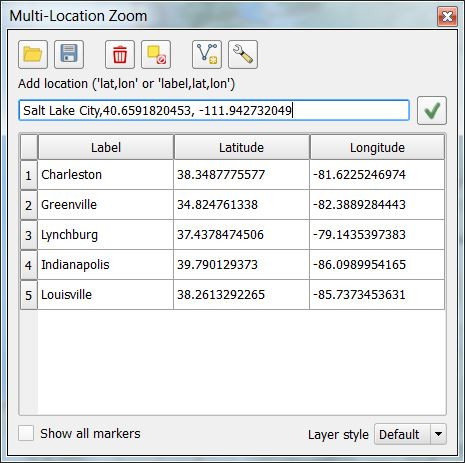

    
    * The ***Show all markers*** displays markers of all locations.

* ***Copy Extents to Clipboard*** - There are four tools used to copy a bounding box extent to the clipboard. The bounding box format is determined in settings dialog. The output CRS for the bounding box extent is either that of the QGIS project or EPSG:4326. The four copy extent tools are:

    * 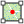 - Copy the canvas bounding box extent to the clipboard.
    * 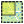 - Interactively select a region on the map to extract its bounding box extent and copy it to the clipboard.
    * 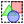 - Copy the selected layer's extent. In some vector layers, this value may be estimated and not exact depending on how the layer was imported into QGIS.
    *  - Copy the bounding box extent of selected features in a vector layer. If no features are selected then nothing will be copied. If the layer is not a vector layer, then the bounding box extent of the layer will be copied. In some vector layers, the bounding box extent may be estimated and not exact depending on how the layer was imported into QGIS.

*  ***Coordinate Conversion Tool*** - This dialog provides a way to either type in a coordinate or grab a coordinate from the map and convert it to a number of different formats.
    
    
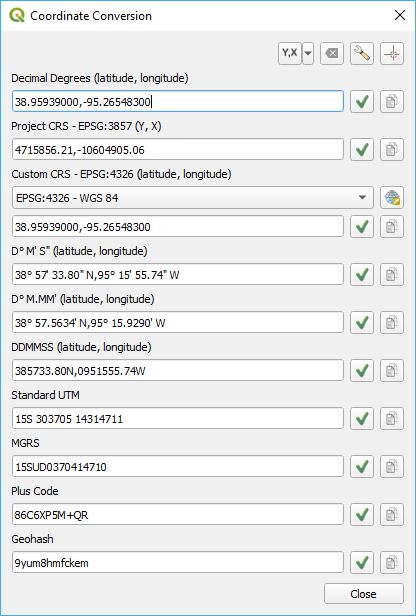

    
    Type in a coordinate in any one of the formats listed and then press the enter button and all the other coordinates will be populated. Here are the functions of the following icons:
    
    * 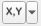 / 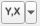 ***Coordinate order*** - Select whether the coordinates should be displayed in an **x,y (longitude, latitude)** or **y,x (latitude, longitude)** order.
    *  ***Clear form*** - This clears the form of all values.
    *  ***Show coordinate conversion settings*** - This shows the default settings for coordinate conversion.
    *  ***Zoom to*** will zoom to the  coordinate in the Decimal Degrees field.
    *  ***Capture coordinate*** enables the user to click on the map to capture a coordinate directly to the form and have it automatically converted.
    * 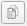 ***Copy to clipboard*** copies the value in the text area onto the clipboard.

* 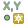 ***Lat Lon Digitizing Tool*** - This tool digitizes points and add features the selcted layer using the same coordinate input formats as the ***Zoom, to Latitude, Longitude***. A point vector layer must be selected and be edit mode for this tool to be enabled. When the user clicks on the tool, the following dialog is displayed.
    
    
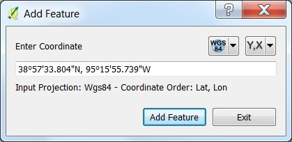

    
    Enter a coordinate in any of the ***Zoom to Latitude, Longitude*** formats and press **Enter** or click on the **Add Feature** button. If a layer contains fields then a secondary dialog box will popup to allow editing of the attributes.
    
    The projection of the input coordinates can be specified by the CRS drop down menu which has the following options:
    
    * 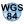 ***WGS84 Projection*** - This is the default specifying coordinates as latitudes and longitudes.
    *  ***MGRS Coordinate*** - This specifies an MGRS coordinate.
    *  ***Project Projection*** - With this selected, it is assumed that the input coordinates are in the projection of the project.
    * 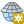 ***New/Custom Projection*** - This allows the user to select any projection for the input coordinates.
    *  ***Plus Codes Coordinate*** - This specifies a Plus Code coordinate.
    
    The next drop down menu specifies whether the coordinates are listed as **Y,X (Latitude, Longitude)** or **X,Y (Longitude, Latitude)**. If the coordinate uses **N, S, E, W** then these take presidence and this setting is ignored.
    
    *  ***Y,X (Latitude, Longitude) Order***
    *  ***X,Y (Longitude, Latitude) Order***
    
    Right below the text input box is a status line that tells you exactly what CRS and coordinate order you are using.
    
* ***Conversions***

    All of the conversion routines can eighter be access from the ***Lat Lon Tool*** main menu or from the ***Processing*** ***Lat Lon Tools*** toolbox.
    
    
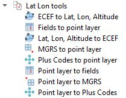

    *  ***Fields to point layer*** - This converts ASCII coordinates found in one or two attribute fields into a new point geometry layer. If the coordinates are numeric and are in two fields, then the default QGIS importer can be used. This importer supports formats not available by the QGIS importer such as DMS, MGRS, Plus Codes (Open Location Code), Standard UTM, Geohash, Maidenhead grid locator, and X & Y (latitude & longitude) coordinates that are in a single field separated by a separator.  Select the input coordinate format which may be found in one or two fields. Decimal and DMS coordinates can be in one or two fields, but MGRS, Plus Codes, Geohash, and Maidenhead grid coordinates are always in one field. When DMS or Decimal coordinates are in 1 field select which order the Y & X (latitude & longitude) coordinates are in. The order is important if the hemisphere indicators N,S,E,W are not present. The column 'Select the field containing the X or longitude coordinate' is used when the coordinates are in two fields. 
    
    
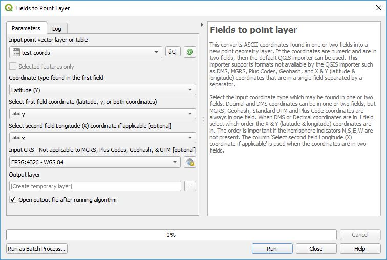

    
    * 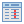 ***Point layer to fields*** - This takes a point vector layer and creates a new layer with the layer's latitude, longitude (Y, X) coordinates copied into one or two fields in the new output layer. The user has a lot of flexibility as to the output format. For Wgs84 the output can be in decimal degrees or DMS. Other formats include GeoJSON, WKT, MGRS, Standard UTM, Geohash, Plus Codes, and Maidenhead grid. 
    
    
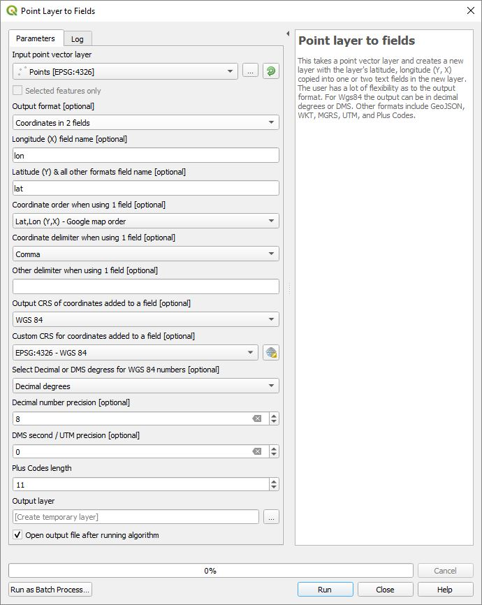

    
    * 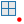 ***MGRS to point layer*** - The input for this conversion is a table or vector layer containing a field with MGRS coordinates. It converts the MGRS field to a new point vector layer where each record is converted to WGS 84 (EPSG:4326) geometry.
    
    
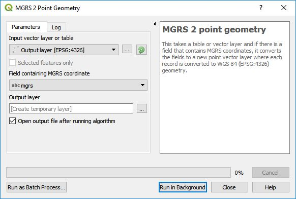

    * 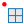 ***Point layer to MGRS*** - Convert a point vector layer into a new layer with an added MGRS column containing coordinates based on the vector layer's geometry. MGRS supports measuring precision's of 1m, 10m, 100m, 1km, 10km, and 100km. **MGRS Precision** of 5 is 1m and an **MGRS Precision** of 0 represents a point accuracy of 100km.
    
    
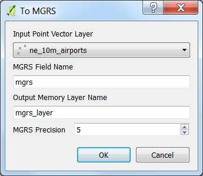

    *  ***Plus Codes to point layer*** - Convert a Plus Codes field from a table or vector layer into a new point vector layer where each record is converted to WGS 84 (EPSG:4326) geometry.

    
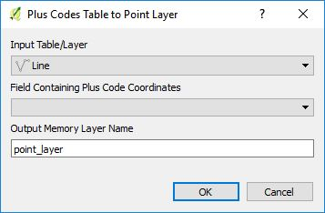

    *  ***Point layer to Plus Codes*** - Convert a point vector layer into a new layer with an Plus Codes column, containing coordinates based on the vector layer's geometry.

    
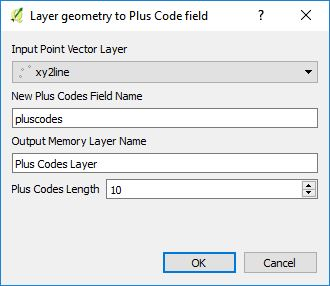

    *  ***ECEF to Lat, Lon, Altitude*** - Convert an ECEF (Earth-centered, Earth-fixed coordinate system) layer into a new point layer that includes the altitude as a part of the geometry and optionally as an attribute.

    *  ***Lat, Lon, Altitude to ECEF*** - Convert a point vector layer that includes an altitude Z dimension as a part of the geometery or as a part of the attribute table into an ECEF (Earth-centered, Earth-fixed coordinate system) layer.

*  ***Settings*** - Displays the settings dialog box (see below).
*  ***Help*** - Displays this help page.

## Settings

> 
The <b>CRS</b> and <b>coordinate order</b> are set independently for the coordinate capture, zoom to, and multi-zoom to tools. Be careful when setting one of these settings, that you check the rest to make sure that they are set correctly for your needs.

### Capture & Display Settings

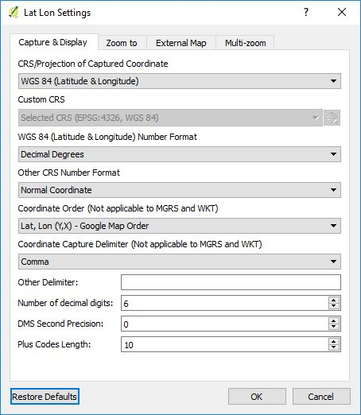

There are 7 capture projections/formats that can be selected from the ***CRS/Projection of captured coordinate*** drop down menu. They are as follows.

* **WGS 84 (Latitude & Longitude)** - This captures the coordinates as a latitude and longitude regardless of what the project CRS is set to. This is the default setting.
* **Project CRS** - This captures the coordinates using the project's specified CRS.
* **Custom CRS** - The captures the coordinate in any coordinate reference system regardless of what the project CRS is set to. When this is selected, then the ***Custom CRS*** dialog box is activated allowing selection of any projection.
* **MGRS** - This captures the coordinates in the [MGRS](https://en.wikipedia.org/wiki/Military_grid_reference_system) format,
* **Plus Codes** - This captures the coordinate in [Google Plus Codes](https://plus.codes/) format.
* **Standard UTM** - This has the form of '12N 417159.0 4515540.6'
* **Geohash** - This has the form of '9zpnbf0w9yuf'
* Amateur Radio **Maidenhead Grid Locator** - This has the form of 'EM28ix'
* **UPS** (Universal Polar Stereographic) - The string form of this format is one of the following: 'Z 2426773mE 1530125mN' or 'Z2426773E1530125N'
* **GEOREF** - An example coordinate is 'FJKJ4407157563'

Additional coordinate formatting can be specified with ***WGS 84 (Latitude & Longitude) Number Format***.

* **Decimal Degrees** - "42.20391297, -86.023854202"
* **DMS** - "36&deg; 47' 24.27" N, 99&deg; 22' 9.39" W"
* **D&deg;MM'** - "42&deg; 12.2348' N, 86&deg; 1.4313' W"
* **DDMMSS** - "400210.53N, 1050824.96 W"
* **WKT POINT** - POINT(-86.023854202 42.20391297)
* **GeoJSON** - {"type": "Point","coordinates": [-86.02385420,42.20393450]}

For ***Other CRS number format*** such as **Project CRS** or **Custom CRS** the coordinate formatting options are:

* **Normal Coordinate** - Decimal coordinate notation.
* **WKT POINT**

The order in which the coordinates are captured is determined by ***Coordinate order (Not used with MGRS, UTM, UPS, WKT, GeoJSON &amp; Plus codes)*** and are one of the following:

* **Lat, Lon (Y,X) - Google Map Order**
* **Lon, Lat (X,Y) Order**.

* ***Coordinate capture delimiter (Not used with MGRS, UTM, UPS, WKT, GeoJSON &amp; Plus codes)*** - Specifies the delimiter that separates the two coordinates. The options are:
    * **Comma** - Specifies a comma separator 
    * **Comma Space** - This is a comma followed by a space. 
    * **Tab** - This useful if you are pasting the coordinates into two columns of a spreadsheet.
    * **Space**
    * **Other** - With this selected, the contents of ***Other delimiter*** is used.
* ***DMS second precision*** - Used when formatting DMS coordinates and specifies the number of digits after the decimal.
* ***D&deg;MM' precision*** - Used when formatting D&deg;MM' coordinates and specifies the number of digits after the decimal for the minutes.
* ***UTM precision*** - Used when formatting UTM coordinates and specifies the number of digits after the decimal.
* ***UTM format*** - This specifies a UTM string format and is one of the following:
    * '15N 755631 4283168'
    * '755631,4283168,15N'
    * '755631mE,4283168mN,15N'
    * '755631mE,4283168mN,15,N'
* ***UPS precision*** - Used when formatting UPS coordinates and specifies the number of digits after the decimal.
* ***UPS format*** - This specifies a UPS string format and is one of the following: 'Z 2426773mE 1530125mN' or 'Z2426773E1530125N'
* ***MGRS precision*** - This specifies the precision of MGRS coordinates ranging between 0 and 5 with precisions of 100km, 10km, 1km, 100m, 10m and 1m repectively.
* ***Plus codes length*** - Used when formatting Plus Code coordinates. The minimum value is 10.
* ***Geohash precision*** - Used when formatting Geohash coordinates.
* ***Maidenhead grid precision*** - Used when formatting Amateur Radio Maidenhead grid coordinates.The value ranges from 1 to 4.
* ***GEOREF precision*** - Used when formatting GEOREF coordinates. The maximum value is 10.
* ***H3 precision*** - Used when formatting H3 coordinates when the H3 library is installed. Values range from 0 to 15.
* ***Coordinate prefix*** - This text string is added to the beginning of the captured coordinate.
* ***Coordinate suffix*** - This text string is added to the end of the captured coordinate.
* ***Add space between D&deg; M' S" and D&deg; M.MM' numbers*** - When checked a space will be added between each pair of numbers.
* ***Pad DMS and DM.MM output coordinates with leading zeros*** - When checked individual DMS coordinates will be padded with leading zero. A coordinate that normally looks like 1° 5' 15"N, 10° 19' 50"W would become 01° 05' 15"N, 010° 19' 50"W.
* ***Add spaces to MGRS coordinates*** - This will add spaces to an MGRS coordinate when checked. Unchecked it looks like "16TDL8016526461" and checked it looks like "16T DL 80165 26461".
* ***Show marker on QGIS map*** - When checked, a persistent marker stays on the map at the clicked location until another location is clicked on or a new tools is selected.

### Zoom to Settings

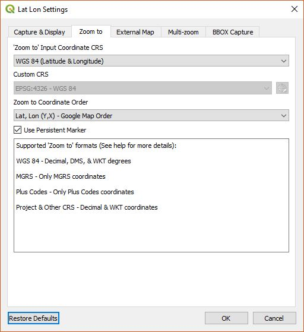

The ***Zoom to Latitude, Longitude*** tool accepts the following input coordinates as specified by ***Zoom to Coordinate Type***:

* **WGS 84 (Latitude & Longitude) / Auto Detect Format** - Input coordinates can be either in decimal degrees, DMS degrees, WKT, or GeoJSON. For decimal and DMS formats, the order of the coordinates are determined by ***Zoom to Coordinate Order***. It also auto detects MGRS, Plus Codes, Standard UTM, UPS, GEOREF, and Geohash formats so it is generally unnecessary to specify them separately.
* **Project CRS** - This accepts coordinates formatted in the CRS of the QGIS project. The numbers can be formatted in decimal or WKT notation.
* **Custom CRS** - You can specify any CRS for the input coordinates and QGIS zooms to that coordinate regardless of the project CRS. The numbers can be formatted in decimal or WKT notation.
* **MGRS** - This only accepts [MGRS](https://en.wikipedia.org/wiki/Military_grid_reference_system) coordinates as input.
* **Plus Codes** - This only accepts [Plus Codes](https://plus.codes/) coordinates as input.
* **Standard UTM** - This only accepts **Standard UTM** coordinates as input.
* **Geohash** - This only accepts **Geohash** coordinates as input.
* **Maidenhead Grid** - This only accepts **Maidenhead Grid** coordinates as input.
* **H3** - This will only be available if the H3 library is installed. It only accepts **H3** coordinates as input.

The order in which the coordinates are parsed in the ***Zoom to Latitude, Longitude*** tool is specified by ***Zoom to Coordinate Type*** and has the following two options: This is not applicable for **WKT**, **GeoJSON**, **MGRS**, **Plus Codes**, and **Standard UTM** coordinates.

* **Lat, Lon (Y,X) - Google Map Order**
* **Lon, Lat (X,Y) Order**

**Use Persistent Marker** - If this is checked, then when you zoom to a coordinate a persistent marker is displayed until you exit, zoom to another location, or click on the  button.

**Show coordinate resolution area** - Some coordinate formats represent an area rather than a point depending on its resolution. These include Geohash, H3, Plus Codes, and Maindenhead. If this is checked, then when you zoom to a coordinate the area represented by the coordinate is displayed until you exit, zoom to another location, or click on the  button.

The colors of the marker and coordinate resolution area bounding box can be changed by setting the **Marker color** and **Grid color**.

### External Map Settings

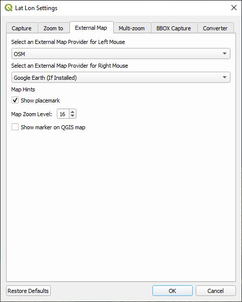

You can ***Select an External Map Provider for Left Mouse***. The options are:

* **OSM** - Open Street Map
* **Google Map**
* **Google Aerial**
* **Bing Map**
* **Bing Aerial**
* **MapQuest Map**
* **MapQuest Aerial**
* **Mapillary Street**
* **Mapillary Aerial**
* **iD Editor ESRI World Imagery**
* **iD Editor OpenTopoMap**
* **Google Earth** - (This only works if it is installed on your system)
* **User Added Map Services...**

***Select an External Map Provider for Right Mouse*** has the same set of options. These correspond to the left and right mouse buttons.

***Map Hints*** are desired attributes you would like to see in the resulting map. 

* **Show placemark** - When checked the external map shows a placemark at the location clicked on in the QGIS map. If this is not checked then the external map centers itself around clicked location, but will not display the placemark. Depending on the map service, this may or may not be available.
* **Map Zoom Level** - This is the desired default zoom level in the external map when it is launched.

Enable the following if a temporary marker is desired to be displayed at the location click on:

* **Show marker on QGIS map**

***Add additional external map providers*** allows the user to add their own map providers by specifying a URL with latitude, longitude, and zoom level defined by the variables {lat}, {lon}, and {zoom}. For example the URL for Open Street Map would be entered as: ***http://www.openstreetmap.org/#map={zoom}/{lat}/{lon}***. The button **Add Provider** adds a new service. **Delete Provider** deletes the selected provider. Once added the map providers will appear in the left and right mouse external map provider menus.

### Multi-location Zoom Settings

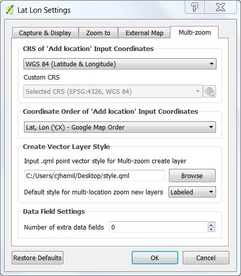

These are settings for the Multi-location zoom dialog box. 

**CRS/Projection of input coordinates**

The user sets the CRS/projection of the coordinates in the ***Enter coordinate*** text box. By default this is set to WGS 84, latitude and longitude. This has no effect on the coordinates in the ***Location List*** that can be read in. The location list must always be WGS 84. The options are:

* **WGS 84 (Latitude &amp; Longitude)**
* **Project CRS**
* **Custom CRS**
* **MGRS**
* **Plus Codes**
* **Standard UTM**

When **Custom CRS** is selected, the user is allowed to select a custom CRS projection.

**Coordinate Order of input coordinates**

The user sets the order of coordinates in the ***Enter coordinate*** text box. The order is either latitude followed by longitude (Y,X) or longitude followed by latitude (X,Y). By default the order is "Latitude, Longitude", the format used by Google Maps. This is not applicable when MGRS or Plus Codes coordinates are being used.

**Create Vector Layer Style**

The user can specify a style when creating a layer from the zoom locations. It can be a simple default style, default with labels, or a .qml style file that contains advanced styling. 

* ***Default style for multi-location zoom new layers*** determines the new layer style when ***Create Vector Layer From Location List*** is clicked on. The options are:
    * ***Default*** - No style is applied.
    * ***Label*** - The newly created layer will have labels next to the points.
    * ***Custom*** - The user can create a QGIS .qml file that contains style information for a point vector layer. If a .qml file has been selected, then this setting will apply the style to the new layer.
    
The ***Browse*** button allows selection of the .qml style file. When a .qml file is selected, ***Custom*** is automatically selected as the default style.
    
**Data Field Settings**
    
* ***Number of extra data fields*** - Besides *Latitude*, *Longitude*, and *Label*, the user can add up to 10 additional data fields which are labeled as *Data1*, *Data2*, ... *Data10*. By default this is set to 0.

### BBox (Bounding Box Extent) Capture Settings

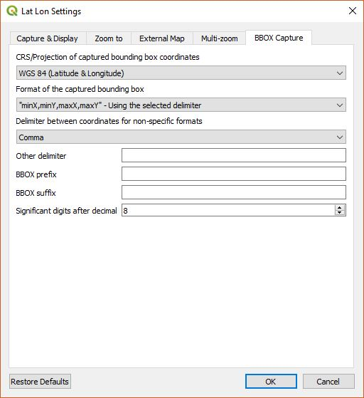

These are the settings for the bounding box capture to clipboard tool.

**CRS/Projection of captured bounding box coordinates**

Specify whether the captured bounding box will use WGS84 or the QGIS project's projections. The options are:

* ***WGS 84 (Latitude & Longitude)***
* ***Project CRS***

**Format of the captured bounding box** specifies the format of the bounding box captured on the clipboard. It can be one of the following formats.

* ***minX,minY,maxX,maxY (W,S,E,N)*** - Using the selected delimiter
* ***minX,maxX,minY,maxY (W,E,S,N)*** - Using the selected delimiter
* ***minY,minX,maxY,maxX (S,W,N,E)*** - Using the selected delimiter
* ***x1 y1,x2 y2,x3 y3,x4 y4,x1 y1*** - Polygon format
* ***x1,y1 x2,y2 x3,y3 x4,y4, x1,y1*** - Alternate polygon format
* ***WKT Polygon***
* ***bbox: [minX, minY, maxX, maxY]*** - Format used by MapProxy
* ***bbox=minX,minY,maxX,maxY*** - Format used by GeoServer WFS, WMS

**Delimiter between coordinates for non-specific formats** - This affects only the first two of the above formats. It is used between coordinates with presets for **Comma**, **Comma Space**, **Space**, **Tab**, and **Other**.

**BBOX prefix** - This text string is added to the beginning of the captured bounding box string.

**BBOX suffix** - This text string is added to the end of the captured bounding box string.

**Significant digits after decimal** - This is the precision or number of digits after the decimal in the output coordinates.

### Coordinate Conversion Settings

These are the default settings for the ***Coordinate Conversion*** dialog box.

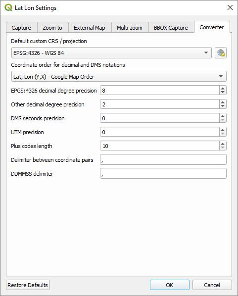

* ***Default custom CRS / projection*** specifies the default projection when a custom CRS is selected.
* ***Coordinate order for decimal and DMS notations*** determines whether the coordinates will be formatted in an ***Lat, Lon (Y, X)*** or ***Lon, Lat (X, Y)*** order.
* ***EPSG:4326 decimal degree precision*** determines the number of digits after the decimal point for a WGS 84 latitude and longitude coordinate.
* ***Other Decimal degree precision*** is the number of digits after the decimal point for all other coordinate formats.
* ***DMS seconds precision*** is the number of decimal digits for the second in a DMS formatted coordinate.
* ***D&deg;MM' precision*** is the number of decimal digits for the minute in a D&deg;MM' formatted coordinate.
* ***UTM precision*** specifies the number of decimal digits for a UTM formatted coordinate.
* ***UTM format*** specifies one of these formats to be displayed: '15N 755631 4283168', '755631,4283168,15N','755631mE,4283168mN,15N', or '755631mE,4283168mN,15,N'.
* ***UPS precision*** specifies the number of decimal digits for a UPS formatted coordinate.
* ***UPS format*** specifies one of these formats to be displayed: 'Z 2426773mE 1530125mN', or 'Z2426773E1530125N'.
* ***Plus codes length*** is the number of digits in a plus code coordinate.
* ***Geohash precision*** is the number of digits in a geohash coordinate.
* ***Maidenhead precision*** specifies the maidenhead coordinate precision.
* ***GEOREF precision*** determins the number of digits in a GEOREF coordinate.
* ***Delimiter between coordinate pairs*** is the delimiter used between coordinate pairs for those representations that require a delimiter.
* ***DDMMSS delimiter*** is the delimiter used between DDMMSS coordinate pairs. Leave this blank if no space is desired between coordinates. The default is ", ".
* ***Add space between D&deg; M' S" and D&deg; M.MM' numbers*** - When checked a space will be added between each pair of numbers.
* ***Pad DMS and DM.MM output coordinates with leading zeros*** - When checked individual DMS coordinates will be padded with leading zero. A coordinate that normally looks like 1° 5' 15"N, 10° 19' 50"W would become 01° 05' 15"N, 010° 19' 50"W.
* ***Add spaces to MGRS coordinates*** - This will add spaces to an MGRS coordinate when checked. Unchecked it looks like "16TDL8016526461" and checked it looks like "16T DL 80165 26461".
